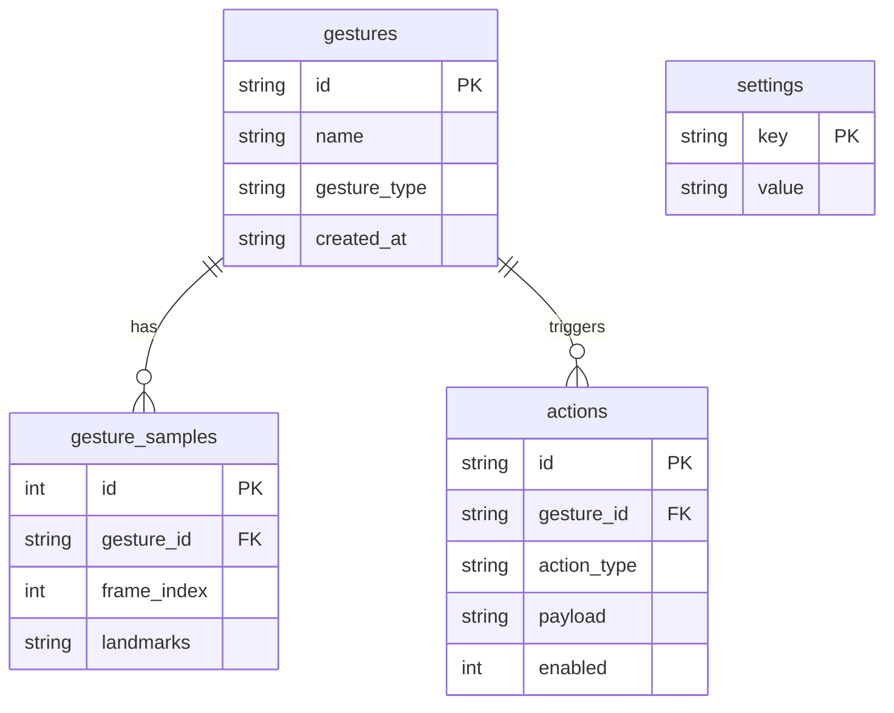

# 04 — Database

## Objetivo

Persistencia local de gestos, muestras, acciones y configuración mediante SQLite embebido.

## Entidades

### gestures

| Columna      | Tipo   | Restricción          | Descripción              |
| ------------ | ------ | -------------------- | ------------------------ |
| id           | TEXT   | PRIMARY KEY          | UUID v4                  |
| name         | TEXT   | NOT NULL             | Nombre del gesto         |
| gesture_type | TEXT   | NOT NULL             | "static" \| "dynamic"    |
| created_at   | TEXT   | NOT NULL             | RFC 3339 timestamp       |

### gesture_samples

| Columna     | Tipo    | Restricción                              | Descripción               |
| ----------- | ------- | ---------------------------------------- | ------------------------- |
| id          | INTEGER | PRIMARY KEY AUTOINCREMENT                | —                         |
| gesture_id  | TEXT    | NOT NULL, FK → gestures(id) ON DELETE CASCADE | Gesto padre           |
| frame_index | INTEGER | NOT NULL                                 | sample*1000 + frame index |
| landmarks   | TEXT    | NOT NULL                                 | JSON de NormalizedLandmarks |

### actions

| Columna    | Tipo    | Restricción                              | Descripción              |
| ---------- | ------- | ---------------------------------------- | ------------------------ |
| id         | TEXT    | PRIMARY KEY                              | UUID v4                  |
| gesture_id | TEXT    | NOT NULL, FK → gestures(id) ON DELETE CASCADE | Gesto asociado      |
| action_type| TEXT    | NOT NULL                                 | OpenApp, ExecuteCommand, etc. |
| payload    | TEXT    | NOT NULL                                 | Argumento de la acción   |
| enabled    | INTEGER | NOT NULL DEFAULT 1                       | Flag booleano            |

### settings

| Columna | Tipo | Restricción | Descripción        |
| ------- | ---- | ----------- | ------------------ |
| key     | TEXT | PRIMARY KEY | Clave de setting   |
| value   | TEXT | NOT NULL    | Valor (string)     |

## Relaciones

```
gestures ──1:N──▶ gesture_samples
gestures ──1:N──▶ actions
```

## Índices

Sin índices explícitos en v1. La tabla gesture_samples usa `frame_index` como discriminante linear.

## Diagrama ER



## Migraciones

La inicialización es automática al abrir la BD mediante `CREATE TABLE IF NOT EXISTS`. No hay sistema de migraciones incremental.

## Configuración

```toml
[storage]
db_path = "C:/Users/<user>/AppData/Roaming/GestureStudio/data/gesture_studio.db"
max_samples_per_gesture = 50
```

## Riesgos

- Sin migraciones. Cambios de esquema requieren borrar la BD manualmente.
- Las landmarks se serializan como JSON; podría optimizarse a binario en futuras versiones.
- Sin índices; consultas pueden degradarse con miles de samples.
