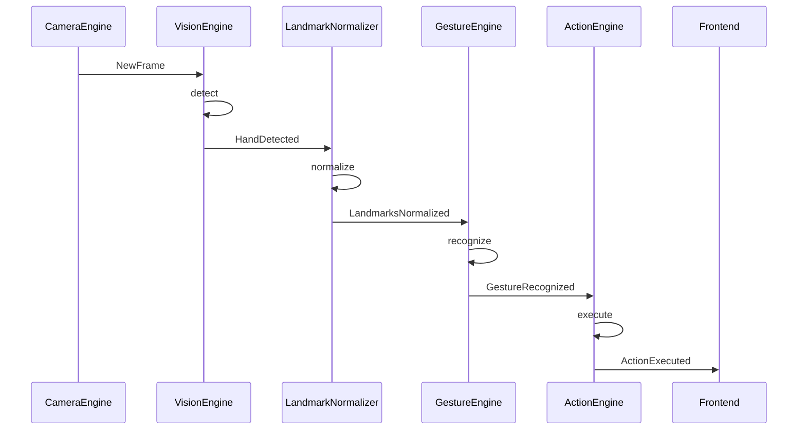

# 07 — Events

## Objetivo

Sistema de eventos desacoplados mediante crossbeam para comunicación asíncrona entre módulos.

## Canal

```rust
let (event_tx, event_rx) = crossbeam_channel::unbounded::<AppEvent>();
```

Tipo: unbounded, multi-productor, multi-consumidor.
- `event_tx`: clonable, distribuido a todos los módulos.
- `event_rx`: consumido por `EventProcessor` (thread dedicado).

## Eventos

### Categoría: camera

| Evento                | Payload               | Publisher    | Subscribers            |
| --------------------- | --------------------- | ------------ | ---------------------- |
| `CameraStarted`       | `{ device: String }`  | CameraEngine | EventProcessor, UI     |
| `CameraStopped`       | —                     | CameraEngine | EventProcessor, UI     |
| `CameraDisconnected`  | `{ reason: String }`  | CameraEngine | EventProcessor         |
| `NewFrame`            | `{ frame: CameraFrame }` | CameraEngine | EventProcessor → VisionEngine |

### Categoría: detection

| Evento                   | Payload                     | Publisher          | Subscribers          |
| ------------------------ | --------------------------- | ------------------ | -------------------- |
| `HandDetected`           | `{ detection: HandDetection }` | VisionEngine    | EventProcessor       |
| `HandsLost`              | —                           | VisionEngine       | EventProcessor       |
| `LandmarksNormalized`    | `{ landmarks: NormalizedLandmarks }` | LandmarkNormalizer | EventProcessor → GestureEngine |

### Categoría: recognition

| Evento               | Payload                        | Publisher      | Subscribers          |
| -------------------- | ------------------------------ | -------------- | -------------------- |
| `GestureRecognized`  | `{ gesture: RecognizedGesture }` | GestureEngine | EventProcessor → ActionEngine |

### Categoría: training

| Evento                      | Payload                             | Publisher      | Subscribers |
| --------------------------- | ----------------------------------- | -------------- | ----------- |
| `GestureTrainingStarted`    | `{ gesture_id: Uuid }`              | GestureTrainer | UI          |
| `GestureTrainingSample`     | `{ gesture_id: Uuid, sample_index: u32 }` | GestureTrainer | UI    |
| `GestureTrainingComplete`   | `{ gesture_id: Uuid, template: GestureTemplate }` | GestureTrainer | UI, Storage |

### Categoría: action

| Evento            | Payload                        | Publisher      | Subscribers |
| ----------------- | ------------------------------ | -------------- | ----------- |
| `ActionTriggered` | `{ action: AssignedAction }`   | ActionEngine   | —           |
| `ActionExecuted`  | `{ result: ExecutionResult }`  | ActionEngine   | UI          |
| `ActionFailed`    | `{ action_id: Uuid, error: String }` | ActionEngine | UI      |

### Categoría: system

| Evento          | Payload                           | Publisher      | Subscribers    |
| --------------- | --------------------------------- | -------------- | -------------- |
| `ConfigChanged` | —                                 | app/commands   | EventProcessor |
| `StorageUpdated`| —                                 | Storage        | UI             |
| `Error`         | `{ message, source }`            | Cualquier módulo | UI           |
| `Shutdown`      | —                                 | Cualquier módulo | EventProcessor |

## Diagrama de Flujo de Eventos



## Consumo

`EventProcessor` (hilo dedicado en `app/`) recibe eventos y los rutea al motor correspondiente. El frontend recibe eventos mediante listeners de Tauri.
